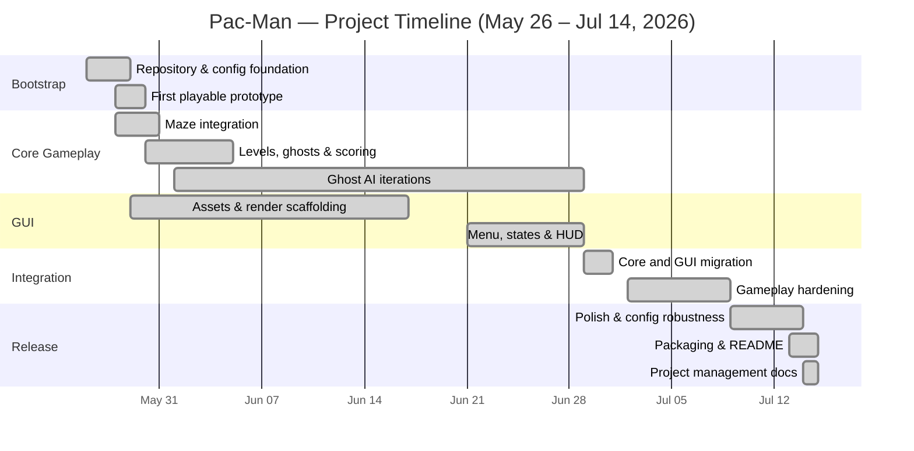

# Gantt Chart

The chart summarizes the actual development phases visible in the repository
history. GitHub renders Mermaid diagrams directly.

## Notes

- Workstreams overlap because the two team members developed core gameplay and
  graphical systems in parallel.
- The long ghost-AI span reflects several design iterations rather than one blocked
  task.
- The Jun 29–30 integration phase was the main convergence point between the two
  workstreams.
- Final robustness tasks were tracked using Jira ticket branches such as
  `SCRUM-44`, `SCRUM-45`, and `SCRUM-46`.
