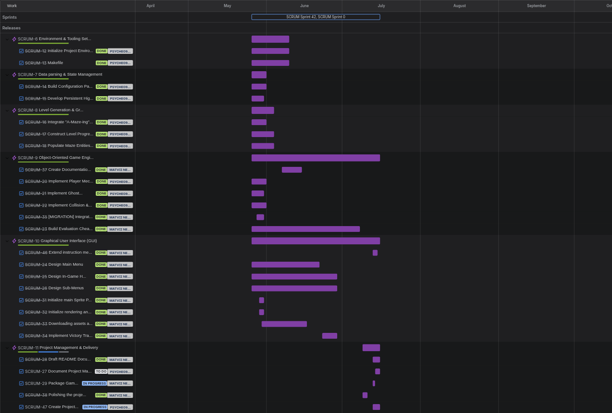

# Timeline

The project was developed iteratively through backend implementation, parallel
frontend development, integration, testing, and final validation.

## Development Phases

### Phase 1 — Backend Prototype

The first playable version focused on configuration, maze integration, player
movement, scoring, ghost logic, level progression, and highscores.

### Phase 2 — Parallel Backend and Frontend Development

`wehan` continued developing the backend gameplay systems while `mnestere`
developed the pygame frontend, including sprites, rendering, menus, game states,
and the HUD.

### Phase 3 — Frontend Integration

`mnestere` integrated the frontend with the existing backend gameplay logic.
Small integration changes were handled during frontend development. When major
backend changes were required, they were discussed and handled by `wehan` through
separate Jira tasks, GitHub branches, and pull requests.

### Phase 4 — Testing and Hardening

Gameplay, ghost behavior, maze generation, configuration handling, highscores,
and frontend behavior were tested and refined. Larger bugs or missing requirements
were tracked as separate Jira tasks and completed through the branch and pull
request workflow.

### Phase 5 — Final Validation and Documentation

The team reviewed the project against the subject requirements, completed final
fixes, prepared the public game package, and finalized project documentation.

## Jira Timeline

The Jira timeline provides a visual overview of task scheduling and overlapping
work during project development.

## Planned vs Actual Progress

| Area | Initial Plan | Actual Development |
|------|--------------|--------------------|
| Backend | Build the core gameplay first | Developed first and refined throughout the project |
| Frontend | Develop the graphical layer in parallel | Built in parallel and later integrated with the backend |
| Maze | Integrate the assigned maze package | Integrated through an adapter and later hardened |
| Ghost AI | Implement autonomous ghost behavior | Refined through several movement approaches before the final junction-based logic |
| Integration | Connect backend and frontend | Required a dedicated integration phase and several follow-up fixes |
| Validation | Test the final integrated game | Subject compliance and larger issues were tracked through focused Jira tasks |
| Documentation | Complete project documentation | README and project management documentation were finalized near the end |